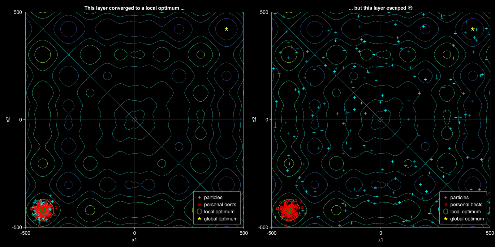

# SLSLQPSO - Short-Lived Swarm Layer Quantum-behaved Particle Swarm Optimization

## Introduction

This is the repository for SLSL-QPSO.



## How to reproduce the results

The code is tested with Julia 1.9.0 on Windows 11.

### 1. Install Julia (on Windows)

```powershell
winget install --id 9NJNWW8PVKMN
juliaup add 1.9
juliaup default 1.9
```

see [JuliaLang/juliaup](https://github.com/JuliaLang/juliaup) for detailed instructions on how to install (a specific version of) Julia on other platforms.

### 2. Reproduce the results

Navigate to the project root, then run `julia`.
When the input prompt appears, type the following commands followed by `Enter`:
```julia
> ]activiate .
```

You should see the prompt changed to `(SLSLQPSO) pkg>`.

Then you need to install the dependencies:
```julia
(SLSLQPSO) pkg> instantiate
```

After the dependencies are installed, you can run the benchmark by typing the following command:

```julia
> include("benchmark.jl")
```
This will run the benchmark and save the results for each algorithm separately:

- QPSO $\rightarrow$ `benchmark_qpso.xlsx`
- θ-QPSO $\rightarrow$ `benchmark_θqpso.xlsx`
- WQPSO $\rightarrow$ `benchmark_wqpso.xlsx`
- GAQPSO $\rightarrow$ `benchmark_gaqpso.xlsx`
- SLSLQPSO $\rightarrow$ `benchmark_slslqpso.xlsx`

Note the benchmark will use all available CPU cores.
You can alter this behavior by changing the lines in `benchmark.jl`:

```julia
if nprocs() < Sys.CPU_THREADS
	addprocs(Sys.CPU_THREADS - nprocs(), exeflags = "--project")
end
```
to

```julia
addprocs(THE_NUMBER_OF_CORES_YOU_WANT_TO_USE_FOR_BENCHMARK, exeflags = "--project")
```

### 2. Reproduce the result summary
After the benchmark is done, run the following commands:

```julia
include("summary.jl")
```
This will generate a summary of the benchmark results in `summary.xlsx`.

## Note


- if you run the benchmark one more time, the previous results will be overwritten.
- You don't need to restart the REPL to run the benchmark again. Simply run `include("benchmark.jl")` again is sufficient.
- The first time for compiling `GLMakie` (a dependency of this project that is used to plot graphs) may take a while and uses a lot of computing resources.
Subsequent runs will be much faster.

## Supplementary materials

Various other scripts are in the scripts folder.

- `scripts/plot-surface-contour.jl` will generate the surface and contour plots of the benchmark functions.
- `scripts/schwefel-2d-escape.jl` will plot animation that compares the escaping ability of QPSO and SLSL-QPSO on 2-D Schwefel function.
- `scripts/plot-escape-demo.jl` will plot a demo about how the re-initialization strategy works on 2-D Schwefel function.
- `scripts/plot-chaotic-bound.jl` will plot the chaotic bound of the chaotic map used in SLSL-QPSO.
- `scripts/plot-levy-mutation.jl` will plot the Levy mutation used in SLSL-QPSO.
- `scripts/plot-fitness-graph.jl` will plot the fitness graph of some benchmark functions of concern.